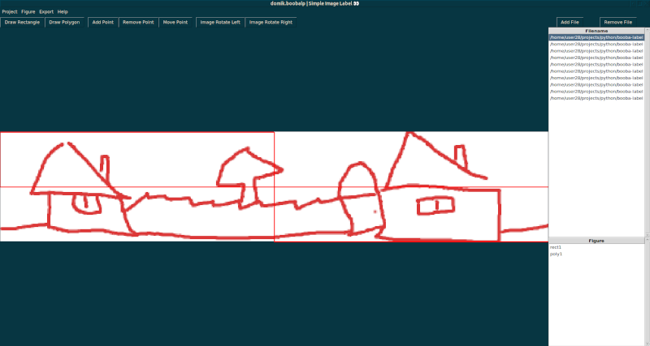

# image-label
Simple Python Tkinter image labelling app for ML purposes

```
'<Control-n>' create new project
'<Control-o>' open project
'<Control-s>' save project
'<Control-i>' add file
'<Control-r>' or '<KeyPress-1>' draw rectangle
'<Control-p>' or '<KeyPress-2>' draw polygon
'<KeyPress-a>' add new point to existing figure (works only for polygons)
'<KeyPress-x>' remove point from existing figure (if point on rectangle then removes entire figure)
'<KeyPress-g>' move point to another location
'<Control-z>' undo last action only for current file
'<Double-Left-Click>' on file item on files list select file as active
'<Left-Click>' on figure item on figures list select figure on canvas
'<Right-Click>' on figure item on figures list show context menu
'<Left-Arrow>' or '<Up-Arrow>' select previous file
'<Right-Arrow>' or '<Down-Arrow>' select next file
'<KePress-q>' rotate CCW (Left)
'<KePress-e>' rotate CW (Right)
``` 

